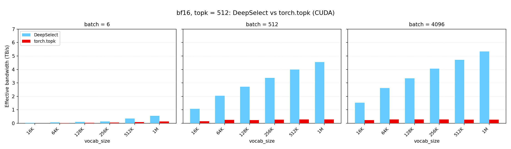
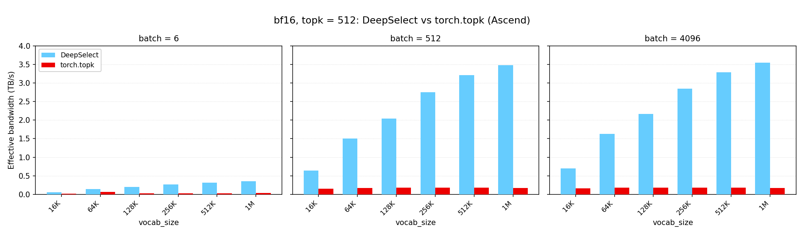
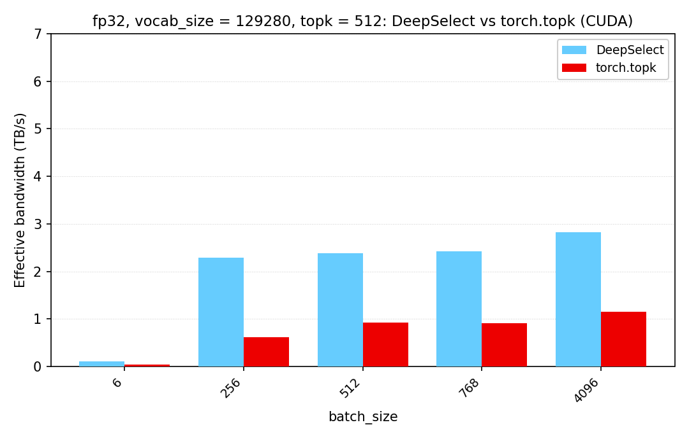

# DeepSelect

DeepSelect is a high performance implementation of the TopK kernel used in DeepSeek Sparse Attention (DSA) (which is used in DeepSeek V3.2, DeepSeek V4, and DeepSeek V4.1 models) and the sampler. It supports NVIDIA CUDA and Huawei Ascend platforms, and achieves 2 ~ 20x speedup compared to vanilla `torch.topk`.

DeepSelect 是为 DeepSeek 稀疏注意力（DeepSeek Sparse Attention, DSA）和采样器（Sampler）定制的高性能 TopK 算子，支持 NVIDIA CUDA 平台与华为昇腾（Ascend）平台。与原生 `torch.topk` 相比，它可实现 2～20 倍的加速。

## News

- 2026.09.30: We've released TopK kernels for Huawei Ascend NPU
- 2026.09.10: We've released a brief analysis of the algorithm and its implementation: [English](docs/DeepSelect-deep-dive.md) | [中文](docs/DeepSelect-deep-dive.zh.md)
- 2026.09.10: We've released DeepSelect v1.0.0

## Supported Cases

TopK workloads vary widely, and the fastest algorithm & implementation highly depends on the input dtype, `batch_size`, `vocab_size`, and `topk`. This repository only focuses on the following cases:

### Lightning Indexer Scenario

This scenario covers:
- Input dtype: `torch.bfloat16`
- `batch_size`: $1 \sim +\infty$ (both large and small batch sizes are optimized)
- `vocab_size`: $1 \sim +\infty$ (both large and small vocabularies are optimized)
- `topk`: small (must be $\le 4096$; larger values are not supported), mainly optimized for `topk=512` (i.e., DeepSeek V4's `topk`)

Recommendations:
- Disable `sorted_index` unless the output has to be ordered by index; enabling it costs performance.
- Set `return_value=False` when the values are not needed. This skips the value output and is faster.

### Sampling Scenario

This scenario covers:
- Input dtype: `torch.float32`
- `batch_size`: $1 \sim +\infty$
- `vocab_size`: around 128K
- `topk`: small (must be $\le 4096$; larger values are not supported)

Currently, only the CUDA implementation supports `torch.float32` as the input dtype. The Ascend implementation supports `torch.bfloat16` only.

## Performance

Measured with the benchmark in [`tests/test.py`](tests/test.py)
(`python3 tests/test.py --perf-only`), which reports the ratio against `torch.topk`
on the same input. The metric is effective memory bandwidth: TopK does no
floating-point math, so a FLOP rate would not be meaningful here.

### Lightning Indexer Scenario (CUDA)

bfloat16, `topk = 512`, one subplot per batch size.



### Lightning Indexer Scenario (Ascend)

bfloat16, `topk = 512`, one subplot per batch size.



### Sampling Scenario (CUDA)

float32, `vocab_size = 129280`, `topk = 512`.



## Installation

```bash
git clone https://github.com/deepseek-ai/DeepSelect.git
cd DeepSelect
git submodule update --init --recursive
pip install -v .
```

## Usage

```python
import torch
import deep_select

# input: (batch_size, vocab_size), torch.bfloat16 or torch.float32.
# Its row stride must be a multiple of `deep_select.get_stride_requirement()[0]` bytes, and its last dimension must be contiguous.
batch_size, vocab_size, topk = 4, 204800, 1024

x = torch.randn(batch_size, vocab_size, dtype=torch.bfloat16, device="cuda")

values, indices = deep_select.topk(
    x,
    topk,
    sorted=False,              # sort the result by values in descending order (only the FP32 variant on the CUDA platform supports this)
    sorted_index=True,         # return each row's indices in ascending order
    indices_type=torch.int32,  # torch.int32 or torch.int64 (The Ascend implementation only supports `torch.int32`)
    return_value=True,         # False skips the value output (~10% faster)
)
# values:  (batch_size, topk) of x.dtype
# indices: (batch_size, topk) of indices_type
```

The row stride of the input tensor (`x`) must be aligned to `deep_select.get_stride_requirement()[0]` bytes. For unaligned inputs, padding is necessary.

Both outputs are allocated by the call, and their strides are aligned to `deep_select.get_stride_requirement()[1]` bytes (so they may be non-contiguous). Pass `output_idx=` to write indices into a buffer you own, and that buffer must satisfy the same stride requirement.

For the full signature, see [`deep_select/interface.py`](deep_select/interface.py).

### Variable-length rows

`end` sets a per-row upper bound (exclusive). Rows shorter than `topk` are padded with
`value_oob_fill_value` / `idx_oob_fill_value`:

```python
batch_size, vocab_size = 2, 129280   # 129280 is a multiple of 256, so float32 is fine
x = torch.randn(batch_size, vocab_size, dtype=torch.float32, device="cuda")

end = torch.tensor([129280, 100000], dtype=torch.int32, device="cuda")  # (batch_size,)
values, indices = deep_select.topk(x, 1000, end=end, sorted=True,
                                   indices_type=torch.int64)
```

### NaN handling

NaN checking is always on. With the default `abort_when_nan_found=True` the kernel invokes `trap()` and aborts. For the CUDA implementation, rows whose length is `<= topk` are never NaN-checked.

## Citation

```text
@misc{deepselect2026,
    title={DeepSelect: High-Performance TopK Kernels for DeepSeek Sparse Attention and Sampling},
    author={Yi Qian and Shengyu Liu and Yichen Li},
    year={2026},
    publisher = {GitHub},
    howpublished = {\url{https://github.com/deepseek-ai/DeepSelect}},
}
```
